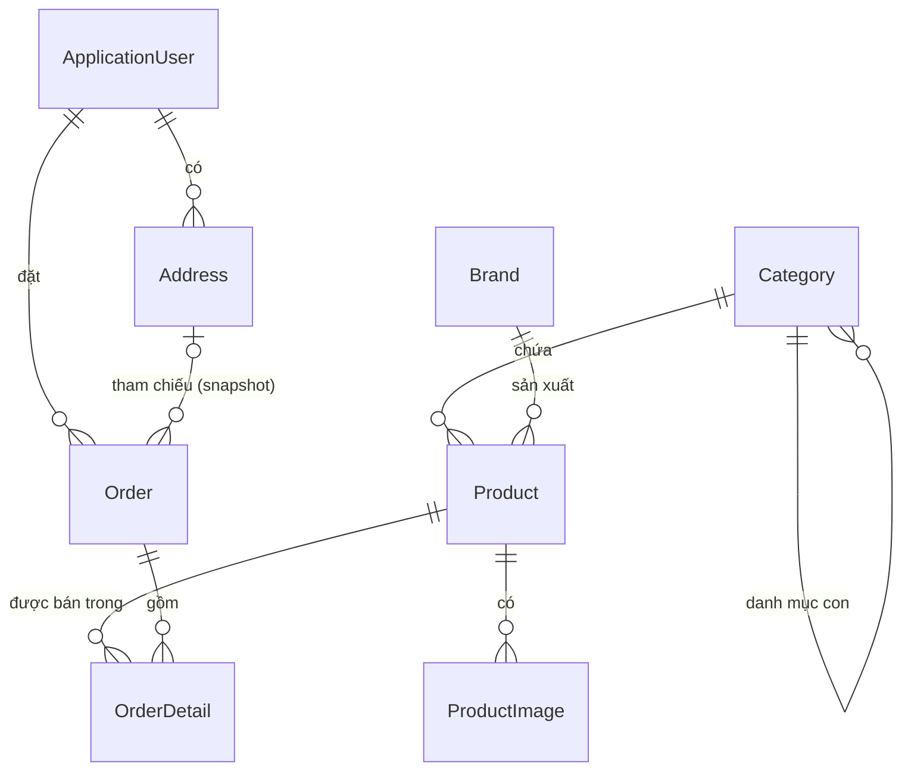

# Database Schema — ElectronicStore

Tài liệu thiết kế database cho website bán linh kiện điện tử.

> **Trạng thái:** tài liệu này là nguồn chuẩn duy nhất về database của dự án.
> Nếu khi code cần thay đổi so với thiết kế, **sửa file này trước** rồi mới sửa code.
>
> | Nhóm bảng | Task | Trạng thái |
> | --- | --- | --- |
> | `Categories`, `Brands` | CORE-06 | ✅ đã triển khai |
> | `Products`, `ProductImages` | CORE-07 | ✅ đã triển khai |
> | `AspNetUsers` + các bảng Identity | CORE-08 | ✅ đã triển khai |
> | `Addresses` | CORE-14, ADDR-01 → FINAL-ADDR | ✅ đã triển khai |
> | `Orders`, `OrderDetails` | CORE-15 | ✅ đã triển khai |
>
> Toàn bộ 8 bảng nghiệp vụ ở trên (cộng các bảng Identity) là **tất cả** những gì database
> hiện có. Không có bảng `ShippingAddresses` riêng: sổ địa chỉ và checkout dùng chung đúng
> một entity `Address` (xem mục 8). Các bảng ghi ở mục 11 và 13 **chưa được triển khai**.
>
> Migration (đúng thứ tự, xem `Migrations/`):
>
> | # | Migration | Nội dung |
> | --- | --- | --- |
> | 1 | `AddCatalogModels` | `Categories`, `Brands`, `Products`, `ProductImages` |
> | 2 | `AddIdentityAndOrderFoundation` | Các bảng Identity + `Addresses`, `Orders`, `OrderDetails` |
> | 3 | `AddAdministrativeUnitCodesToAddress` | `Addresses`: thêm `ProvinceCode`, `WardCode`; `District` thành `NULL` |

- **DBMS:** SQL Server
- **ORM:** Entity Framework Core 10 (Code First + Migrations)
- **DbContext:** `ElectronicStore.Data.ApplicationDbContext`

---

## 1. Quy ước chung (Conventions)

Áp dụng cho toàn bộ bảng, để code của các thành viên đồng nhất.

| Chủ đề | Quy ước |
| --- | --- |
| Tên bảng | Số nhiều (`Products`, `Categories`, `OrderDetails`). Bảng Identity giữ nguyên tên mặc định `AspNetUsers`, `AspNetRoles`, ... |
| Khóa chính | `Id` kiểu `int IDENTITY(1,1)` cho mọi bảng nghiệp vụ. Riêng user dùng `nvarchar(450)` vì kế thừa từ ASP.NET Core Identity |
| Chuỗi | `nvarchar` + luôn khai báo `MaxLength` rõ ràng (không để `nvarchar(MAX)` trừ khi thật sự cần) |
| Tiền tệ | `decimal(18,2)`. VND thực tế không có phần lẻ nhưng vẫn giữ 2 chữ số để tránh sai số khi tính giảm giá / phí ship |
| Thời gian | `datetime2`, **lưu theo UTC** (`DateTime.UtcNow`), chỉ đổi sang giờ VN khi hiển thị |
| Enum | Lưu xuống DB dạng `int` (xem mục 12 để biết lý do) |
| Xóa dữ liệu | Ưu tiên **soft delete** bằng cờ `IsActive` cho Category / Brand / Product / User. Không xóa cứng dữ liệu đã phát sinh đơn hàng |
| Audit | `CreatedAt` (NOT NULL) và `UpdatedAt` (NULL, chỉ set khi có chỉnh sửa) cho các bảng do admin quản trị |
| Slug | Chuỗi URL-friendly, chữ thường, không dấu, phân cách bằng `-`. Dùng cho SEO: `/san-pham/ram-corsair-vengeance-16gb` |

---

## 2. Sơ đồ quan hệ (ERD)



Tóm tắt quan hệ:

| Quan hệ | Loại | Ghi chú |
| --- | --- | --- |
| Category 1 → N Product | 1-N | Bắt buộc: sản phẩm luôn thuộc 1 danh mục |
| Category 1 → N Category | 1-N tự tham chiếu | `ParentCategoryId` cho danh mục cha/con (tùy chọn, xem mục 5) |
| Brand 1 → N Product | 1-N | Bắt buộc |
| Product 1 → N ProductImage | 1-N | Ảnh phụ thuộc hoàn toàn vào sản phẩm |
| User 1 → N Address | 1-N | Sổ địa chỉ giao hàng |
| User 1 → N Order | 1-N | Lịch sử đơn hàng |
| Order 1 → N OrderDetail | 1-N | Dòng hàng trong đơn |
| Product 1 → N OrderDetail | 1-N | Chỉ để truy vết, dữ liệu hiển thị đã snapshot |
| Address 0..1 → N Order | 1-N tùy chọn | `Order.AddressId` chỉ để truy vết; `SET NULL` khi khách xóa địa chỉ |

---

## 3. ApplicationUser (bảng `AspNetUsers`)

> Bảng này do **ASP.NET Core Identity** sinh ra (CORE-08). `ApplicationUser` kế thừa
> `IdentityUser` và chỉ thêm field riêng của dự án; toàn bộ cột chuẩn của Identity
> (`AspNetRoles`, `AspNetUserRoles`, `AspNetUserClaims`, `AspNetUserLogins`,
> `AspNetUserTokens`, `AspNetRoleClaims`) giữ nguyên mặc định.

**PK:** `Id` — `nvarchar(450)` (GUID dạng chuỗi do Identity sinh).

Field kế thừa từ `IdentityUser` (không cần tự khai báo):

| Field | Kiểu | Ghi chú |
| --- | --- | --- |
| `UserName`, `NormalizedUserName` | `nvarchar(256)` | Dự án dùng email làm username |
| `Email`, `NormalizedEmail` | `nvarchar(256)` | |
| `EmailConfirmed` | `bit` | |
| `PasswordHash` | `nvarchar(MAX)` | **Không bao giờ lưu mật khẩu thô** |
| `SecurityStamp`, `ConcurrencyStamp` | `nvarchar(MAX)` | |
| `PhoneNumber`, `PhoneNumberConfirmed` | `nvarchar(MAX)`, `bit` | |
| `TwoFactorEnabled`, `LockoutEnd`, `LockoutEnabled`, `AccessFailedCount` | | Dùng để khóa tài khoản khi sai mật khẩu nhiều lần |

Field mở rộng của dự án:

| Field | Kiểu | Required | Ghi chú |
| --- | --- | --- | --- |
| `FullName` | `nvarchar(100)` | ✅ | Họ tên hiển thị |
| `AvatarUrl` | `nvarchar(500)` | ❌ | Đường dẫn ảnh trong `wwwroot/uploads/avatars` |
| `DateOfBirth` | `date` | ❌ | |
| `CreatedAt` | `datetime2` | ✅ | Ngày đăng ký |
| `IsActive` | `bit` | ✅ | Mặc định `1`. Admin khóa tài khoản = set `0` (soft delete) |

**Index / Unique:** Identity tự tạo `UNIQUE INDEX` trên `NormalizedUserName` và index trên `NormalizedEmail`.

**Phân quyền:** dùng bảng `AspNetRoles` + `AspNetUserRoles` với 2 role: `Admin`, `Customer`.

---

## 4. Category

Danh mục sản phẩm: CPU, Mainboard, RAM, VGA, SSD, PSU, Case, Tản nhiệt...

**PK:** `Id` — `int IDENTITY`

| Field | Kiểu | Required | Ghi chú |
| --- | --- | --- | --- |
| `Id` | `int` | ✅ | PK |
| `Name` | `nvarchar(100)` | ✅ | Tên hiển thị |
| `Slug` | `nvarchar(120)` | ✅ | **UNIQUE**, dùng cho URL |
| `Description` | `nvarchar(500)` | ❌ | |
| `ImageUrl` | `nvarchar(500)` | ❌ | Icon/ảnh danh mục ở trang chủ |
| `ParentCategoryId` | `int` | ❌ | **FK → Category.Id** (tự tham chiếu). `NULL` = danh mục gốc |
| `SortOrder` | `int` | ✅ | Mặc định `0`, dùng để sắp xếp menu |
| `IsActive` | `bit` | ✅ | Mặc định `1` |
| `CreatedAt` | `datetime2` | ✅ | |
| `UpdatedAt` | `datetime2` | ❌ | |

**Khóa ngoại:** `ParentCategoryId → Categories.Id`, `ON DELETE NO ACTION` (tránh cascade vòng lặp trên chính nó — SQL Server không cho phép).

**Index:**
- `UNIQUE (Slug)`
- `INDEX (ParentCategoryId)`
- `INDEX (IsActive, SortOrder)` — phục vụ dựng menu

> **Ghi chú cho nhóm:** `ParentCategoryId` là **tùy chọn cho MVP**. Nếu thấy phức tạp,
> giai đoạn đầu cứ để danh mục phẳng (mọi bản ghi có `ParentCategoryId = NULL`) —
> cột vẫn tồn tại nên sau này bật danh mục 2 cấp mà không cần đổi schema.

---

## 5. Brand

Thương hiệu: Intel, AMD, ASUS, MSI, Gigabyte, Corsair, Kingston...

**PK:** `Id` — `int IDENTITY`

| Field | Kiểu | Required | Ghi chú |
| --- | --- | --- | --- |
| `Id` | `int` | ✅ | PK |
| `Name` | `nvarchar(100)` | ✅ | **UNIQUE** |
| `Slug` | `nvarchar(120)` | ✅ | **UNIQUE** |
| `Description` | `nvarchar(500)` | ❌ | |
| `LogoUrl` | `nvarchar(500)` | ❌ | |
| `IsActive` | `bit` | ✅ | Mặc định `1` |
| `CreatedAt` | `datetime2` | ✅ | |
| `UpdatedAt` | `datetime2` | ❌ | |

**Index:** `UNIQUE (Slug)`, `UNIQUE (Name)`

---

## 6. Product

Bảng trung tâm của hệ thống.

**PK:** `Id` — `int IDENTITY`

| Field | Kiểu | Required | Ghi chú |
| --- | --- | --- | --- |
| `Id` | `int` | ✅ | PK |
| `Name` | `nvarchar(200)` | ✅ | Tên sản phẩm đầy đủ |
| `Slug` | `nvarchar(220)` | ✅ | **UNIQUE** |
| `Sku` | `nvarchar(50)` | ✅ | **UNIQUE** — mã hàng nội bộ, rất cần cho linh kiện |
| `ShortDescription` | `nvarchar(500)` | ❌ | Mô tả ngắn hiển thị ở card sản phẩm |
| `Description` | `nvarchar(MAX)` | ❌ | Mô tả chi tiết (HTML) |
| `Specifications` | `nvarchar(MAX)` | ❌ | **Thông số kỹ thuật dạng JSON** — xem mục 6.1 |
| `Price` | `decimal(18,2)` | ✅ | Giá bán hiện tại. `CHECK (Price >= 0)` |
| `OldPrice` | `decimal(18,2)` | ❌ | Giá gốc để hiển thị "giảm giá". `NULL` = không giảm |
| `StockQuantity` | `int` | ✅ | Mặc định `0`. `CHECK (StockQuantity >= 0)` |
| `CategoryId` | `int` | ✅ | **FK → Categories.Id** |
| `BrandId` | `int` | ✅ | **FK → Brands.Id** |
| `IsActive` | `bit` | ✅ | Mặc định `1`. `0` = ẩn khỏi shop (soft delete) |
| `IsFeatured` | `bit` | ✅ | Mặc định `0`. Sản phẩm nổi bật ở trang chủ |
| `ViewCount` | `int` | ✅ | Mặc định `0`. Đếm lượt xem, dùng cho "xem nhiều nhất" |
| `CreatedAt` | `datetime2` | ✅ | |
| `UpdatedAt` | `datetime2` | ❌ | |

**Khóa ngoại:**

| FK | Tham chiếu | ON DELETE |
| --- | --- | --- |
| `CategoryId` | `Categories.Id` | `NO ACTION` (Restrict) — không cho xóa danh mục còn sản phẩm |
| `BrandId` | `Brands.Id` | `NO ACTION` (Restrict) |

**Index:**
- `UNIQUE (Slug)` — tra cứu trang chi tiết
- `UNIQUE (Sku)`
- `INDEX (CategoryId)` , `INDEX (BrandId)` — lọc theo danh mục / thương hiệu
- `INDEX (IsActive, CategoryId, Price)` — kịch bản phổ biến nhất: lọc danh mục + khoảng giá trên trang Product List
- `INDEX (Name)` — hỗ trợ tìm kiếm `LIKE N'%keyword%'`

> **Quyết định — `BrandId` để NOT NULL:** với linh kiện điện tử gần như luôn xác định được
> hãng, và để NOT NULL giúp query/lọc đơn giản hơn (không phải xử lý `NULL`).
> Nếu sau này cần bán hàng no-name, đổi sang nullable chỉ tốn 1 migration nhỏ.

### 6.1. Quyết định thiết kế: `Specifications` lưu JSON trong `nvarchar(MAX)`

Vấn đề: mỗi loại linh kiện có bộ thông số **hoàn toàn khác nhau**.

- CPU: socket, số nhân, số luồng, xung nhịp, TDP
- RAM: dung lượng, bus, loại (DDR4/DDR5), CAS latency
- SSD: chuẩn kết nối, tốc độ đọc/ghi, dung lượng

Ba phương án đã cân nhắc:

| Phương án | Ưu điểm | Nhược điểm |
| --- | --- | --- |
| **A. Cột cố định** (`Socket`, `Cores`, `BusSpeed`...) | Query & index dễ | Bất khả thi: bảng sẽ có hàng chục cột `NULL`; thêm loại linh kiện mới = phải migration |
| **B. Bảng EAV** `ProductAttribute(ProductId, Name, Value)` | Lọc theo từng thông số được, index được | Query phức tạp (nhiều JOIN/PIVOT), quá nặng so với quy mô đồ án |
| **C. JSON trong 1 cột** ✅ | Linh hoạt tuyệt đối, đọc/ghi 1 lần, code đơn giản, hợp với trang chi tiết chỉ cần *hiển thị* bảng thông số | Không index trực tiếp, không lọc theo thông số bằng SQL thuần |

**Chọn phương án C** vì trong phạm vi MVP, `Specifications` chỉ phục vụ **hiển thị** ở trang
Product Detail. Chức năng **Filter** của đề bài lọc theo Category / Brand / khoảng giá —
đều là cột thật đã có index, không đụng tới `Specifications`.

Định dạng thống nhất: **JSON object phẳng, key–value đều là string**, để view render thẳng thành bảng.

```json
{
  "Socket": "LGA 1700",
  "Số nhân": "14",
  "Số luồng": "20",
  "Xung nhịp tối đa": "5.4 GHz",
  "TDP": "125W",
  "Bảo hành": "36 tháng"
}
```

Lưu ý khi triển khai (CORE-06+):
- Cột lưu `nvarchar(MAX)`; trong C# map thành `string?` rồi deserialize sang `Dictionary<string, string>`.
- **Chưa** đặt `CHECK (ISJSON(Specifications) = 1)`: giai đoạn đang phát triển, ràng buộc này
  chặn luôn cả dữ liệu thử nghiệm dạng text thuần. Khi Admin Product CRUD đã ghi JSON ổn định
  thì bật lên bằng 1 dòng trong `ProductConfiguration`:
  `t.HasCheckConstraint("CK_Products_Specifications", "[Specifications] IS NULL OR ISJSON([Specifications]) = 1")`.
- **Đường nâng cấp nếu sau này cần lọc theo thông số:** tạo computed column persisted
  `JSON_VALUE(Specifications, '$.Socket')` rồi đánh index lên nó — không phải đổi cấu trúc bảng.

---

## 7. ProductImage

Một sản phẩm có nhiều ảnh (gallery ở trang chi tiết).

**PK:** `Id` — `int IDENTITY`

| Field | Kiểu | Required | Ghi chú |
| --- | --- | --- | --- |
| `Id` | `int` | ✅ | PK |
| `ProductId` | `int` | ✅ | **FK → Products.Id** |
| `ImageUrl` | `nvarchar(500)` | ✅ | Đường dẫn tương đối trong `wwwroot/uploads/products` |
| `AltText` | `nvarchar(200)` | ❌ | Cho SEO / accessibility |
| `IsPrimary` | `bit` | ✅ | Mặc định `0`. Ảnh đại diện hiển thị ở danh sách sản phẩm |
| `SortOrder` | `int` | ✅ | Mặc định `0` |
| `CreatedAt` | `datetime2` | ✅ | |

**Khóa ngoại:** `ProductId → Products.Id`, `ON DELETE CASCADE` (ảnh không có ý nghĩa nếu không còn sản phẩm).

**Index:**
- `INDEX (ProductId, SortOrder)`
- `UNIQUE INDEX (ProductId) WHERE IsPrimary = 1` — *filtered unique index*, đảm bảo mỗi sản phẩm chỉ có đúng 1 ảnh chính (EF Core: `.HasFilter("[IsPrimary] = 1")`)

---

## 8. Address

Sổ địa chỉ giao hàng của khách. **Đây là entity địa chỉ duy nhất của hệ thống** — sổ địa chỉ
(`/ShippingAddress`), trang checkout và `OrderService` đều đọc/ghi cùng bảng `Addresses` này.
Không tồn tại bảng `ShippingAddresses` nào khác.

**PK:** `Id` — `int IDENTITY`

| Field | Kiểu | Required | Ghi chú |
| --- | --- | --- | --- |
| `Id` | `int` | ✅ | PK |
| `UserId` | `nvarchar(450)` | ✅ | **FK → AspNetUsers.Id** |
| `FullName` | `nvarchar(100)` | ✅ | Người nhận (có thể khác chủ tài khoản) |
| `PhoneNumber` | `nvarchar(20)` | ✅ | Đã chuẩn hóa: chỉ còn chữ số |
| `AddressLine` | `nvarchar(255)` | ✅ | Số nhà, tên đường |
| `Ward` | `nvarchar(100)` | ✅ | **Tên** Phường / Xã, vd `Phường Ba Đình` |
| `WardCode` | `nvarchar(10)` | ✅ | Mã phường/xã của Tổng cục Thống kê, vd `00004`. `DEFAULT ''` |
| `District` | `nvarchar(100)` | ❌ | **NULL** — cấp Quận/Huyện đã bỏ từ 01/07/2025, xem 8.1 |
| `Province` | `nvarchar(100)` | ✅ | **Tên** Tỉnh / Thành phố, vd `Thành phố Hà Nội` |
| `ProvinceCode` | `nvarchar(10)` | ✅ | Mã tỉnh/thành của Tổng cục Thống kê, vd `01`. `DEFAULT ''` |
| `IsDefault` | `bit` | ✅ | Mặc định `0`. Địa chỉ chọn sẵn khi checkout |
| `CreatedAt` | `datetime2` | ✅ | |
| `UpdatedAt` | `datetime2` | ❌ | |

**Khóa ngoại:** `UserId → AspNetUsers.Id`, `ON DELETE CASCADE` — sổ địa chỉ thuộc về đúng một
tài khoản. Đơn hàng cũ **không** mất vì đã snapshot địa chỉ (xem mục 9.1).

**Index:**
- `INDEX (UserId)` — nạp sổ địa chỉ của một khách
- `INDEX (ProvinceCode)` — lọc / đối soát theo đơn vị hành chính
- `UNIQUE INDEX UX_Addresses_UserId_Default (UserId) WHERE IsDefault = 1` — mỗi user chỉ có
  **tối đa 1** địa chỉ mặc định; đây là ràng buộc do DB ép, không chỉ do code

> Entity có thêm property `FullAddress` ghép `AddressLine, Ward, District, Province` thành 1
> dòng, **bỏ qua phần rỗng/NULL**. Đây **không phải cột** (`builder.Ignore`), chỉ để checkout
> copy sang `Order.ShippingAddress`.

### 8.1. Lưu cả mã và tên đơn vị hành chính (ADDR-02 → FINAL-ADDR)

Form nhập địa chỉ ở **cả** sổ địa chỉ và trang checkout dùng hai selectbox
Tỉnh/Thành phố → Phường/Xã, dữ liệu đọc từ file JSON kèm repo
(`Data/AdministrativeUnits/`, nạp một lần qua `IAdministrativeUnitService`).

Hai quyết định thiết kế:

1. **Lưu cả mã lẫn tên.** Form chỉ post lên `ProvinceCode`/`WardCode`; controller tra tên
   thật từ dataset rồi ghi cả 4 cột. Tên được lưu kèm vì một bản cập nhật dataset về sau có
   thể đổi tên hoặc sáp nhập đơn vị — địa chỉ khách đã lưu phải đọc lên đúng như lúc họ nhập.
   Tên **không bao giờ** lấy từ form, nên sửa `<option>` trong DevTools không ghi được tên giả
   vào database. Controller cũng kiểm tra phường/xã có đúng thuộc tỉnh đã chọn.
2. **`District` nullable.** Từ 01/07/2025 Việt Nam áp dụng cơ cấu hành chính 2 cấp
   (Tỉnh → Phường/Xã), không còn cấp Quận/Huyện. Cột được giữ lại và đổi thành `NULL` thay vì
   xóa, để các dòng ghi trước mốc đó không mất dữ liệu và để còn map được với API vận chuyển
   nào vẫn đòi quận/huyện. Luồng nhập mới không ghi cột này nữa.

`ProvinceCode`/`WardCode` để `DEFAULT ''` (không `NOT NULL` nội dung bắt buộc) vì các dòng tạo
trước ADDR-02 chưa có mã; chuỗi rỗng nghĩa là *"địa chỉ nhập tay kiểu cũ"*, và form sửa địa chỉ
sẽ hiện phần địa giới cũ để khách chọn lại.

---

## 9. Order

**PK:** `Id` — `int IDENTITY`

| Field | Kiểu | Required | Ghi chú |
| --- | --- | --- | --- |
| `Id` | `int` | ✅ | PK |
| `OrderCode` | `nvarchar(20)` | ✅ | **UNIQUE** — mã hiển thị cho khách, vd `DH20260910-0007` |
| `UserId` | `nvarchar(450)` | ✅ | **FK → AspNetUsers.Id** |
| `AddressId` | `int` | ❌ | **FK → Addresses.Id** — chỉ để truy vết, dữ liệu thật đã snapshot bên dưới |
| `ShippingFullName` | `nvarchar(100)` | ✅ | 🔒 Snapshot người nhận |
| `ShippingPhone` | `nvarchar(20)` | ✅ | 🔒 Snapshot số điện thoại |
| `ShippingAddress` | `nvarchar(500)` | ✅ | 🔒 Snapshot — địa chỉ đã ghép đầy đủ thành 1 chuỗi |
| `SubTotal` | `decimal(18,2)` | ✅ | Tổng tiền hàng = `SUM(OrderDetail.LineTotal)`. `CHECK >= 0` |
| `ShippingFee` | `decimal(18,2)` | ✅ | Mặc định `0`. `CHECK >= 0` |
| `TotalAmount` | `decimal(18,2)` | ✅ | `= SubTotal + ShippingFee`. `CHECK >= 0` |
| `Status` | `int` | ✅ | Enum `OrderStatus`, mặc định `Pending` |
| `Note` | `nvarchar(500)` | ❌ | Ghi chú của khách |
| `CreatedAt` | `datetime2` | ✅ | Ngày đặt hàng |
| `UpdatedAt` | `datetime2` | ❌ | Lần cuối admin đổi trạng thái |

> **Đã cố ý để ngoài MVP** (thêm sau bằng 1 migration nhỏ khi thật sự cần):
> `DiscountAmount` + bảng `Coupon`, `PaymentMethod` / `PaymentStatus` (MVP mặc định COD),
> `CancelReason`, các mốc thời gian `ConfirmedAt` / `ShippedAt` / `CompletedAt` / `CancelledAt`,
> và `RowVersion` cho optimistic concurrency.

**Khóa ngoại:**

| FK | Tham chiếu | ON DELETE | Lý do |
| --- | --- | --- | --- |
| `UserId` | `AspNetUsers.Id` | `NO ACTION` (Restrict) | Xóa user **không** được làm mất lịch sử đơn hàng. User chỉ bị khóa bằng `IsActive = 0` |
| `AddressId` | `Addresses.Id` | `SET NULL` | Khách xóa địa chỉ trong sổ thì đơn cũ vẫn còn nguyên nhờ snapshot |

**Index:**
- `UNIQUE (OrderCode)`
- `INDEX (UserId, CreatedAt DESC)` — trang Order History
- `INDEX (Status, CreatedAt DESC)` — màn Order Management của admin

### 9.1. Quyết định thiết kế: vì sao Order phải snapshot

Nếu Order chỉ giữ `AddressId` và OrderDetail chỉ giữ `ProductId`, thì khi:

- admin **đổi giá** sản phẩm → hóa đơn cũ tự đổi giá theo ⇒ **sai lệch kế toán**
- admin **đổi tên / ẩn** sản phẩm → đơn cũ hiển thị sai hoặc trống
- khách **sửa hoặc xóa địa chỉ** → không còn biết đã giao hàng tới đâu

Vì vậy mọi thông tin cần để **in lại hóa đơn** đều được copy vào Order/OrderDetail tại thời
điểm checkout (đánh dấu 🔒 trong bảng). `ProductId` / `AddressId` chỉ còn vai trò tham chiếu
(bấm xem lại sản phẩm), **không** dùng để hiển thị dữ liệu đơn hàng.

### 9.2. `OrderStatus`

| Giá trị | Số | Ý nghĩa |
| --- | --- | --- |
| `Pending` | 0 | Khách vừa đặt, chờ shop xác nhận |
| `Confirmed` | 1 | Shop đã xác nhận đơn |
| `Preparing` | 2 | Đang chuẩn bị / đóng gói hàng |
| `Shipping` | 3 | Đã bàn giao đơn vị vận chuyển |
| `Completed` | 4 | Giao thành công |
| `Cancelled` | 5 | Đã hủy (khách hủy khi còn `Pending`, hoặc admin hủy) |

Luồng chuyển trạng thái hợp lệ (validate ở tầng service, DB không ép):

```
Pending → Confirmed → Preparing → Shipping → Completed
   │          │           │
   └──────────┴───────────┴──────────→ Cancelled
```

- `Completed` và `Cancelled` là trạng thái **kết thúc**, không quay lui.
- Khi chuyển sang `Cancelled`, phải **cộng trả** `StockQuantity` cho từng sản phẩm trong đơn.

**Nơi thực thi (CORE-16 → CORE-18):**

| Quy tắc | Chỗ cài đặt |
| --- | --- |
| Bảng chuyển trạng thái ở trên | `Models/OrderStatusRules.cs` — `CanTransitionTo`, `AllowedNextStatuses` |
| Khách chỉ hủy khi còn `Pending`; shop hủy được tới trước `Shipping` | `CanBeCancelledByCustomer` / `CanBeCancelledByAdmin` |
| Tạo đơn, trừ kho, hoàn kho | `Services/OrderService.cs` |

UI nên dựng dropdown trạng thái từ `AllowedNextStatuses()` để không bao giờ hiển thị một
lựa chọn mà service sẽ từ chối.

**Trừ kho an toàn:** `OrderService` không đọc `StockQuantity` rồi ghi đè. Mỗi sản phẩm được
trừ bằng **một câu UPDATE có điều kiện**
(`WHERE Id = @id AND IsActive = 1 AND StockQuantity >= @qty`); 0 dòng bị ảnh hưởng nghĩa là
khách khác vừa mua mất và cả giao dịch bị rollback. Nhờ vậy `StockQuantity` không bao giờ âm
mà không cần thêm cột `rowversion`. `CHECK (StockQuantity >= 0)` vẫn là lớp chặn cuối.

**Hoàn kho đúng một lần:** thao tác hủy đổi trạng thái bằng
`UPDATE ... WHERE Id = @id AND Status = @statusVuaKiemTra`. Chỉ luồng nào đổi được trạng thái
mới cộng trả tồn kho, nên bấm hủy hai lần không cộng kho hai lần — không cần thêm cột cờ nào.


---

## 10. OrderDetail

Dòng hàng trong đơn. **Đây là bản ghi lịch sử — sau khi tạo thì không sửa.**

**PK:** `Id` — `int IDENTITY`

| Field | Kiểu | Required | Ghi chú |
| --- | --- | --- | --- |
| `Id` | `int` | ✅ | PK |
| `OrderId` | `int` | ✅ | **FK → Orders.Id** |
| `ProductId` | `int` | ✅ | **FK → Products.Id** — chỉ để link sang trang sản phẩm |
| `ProductName` | `nvarchar(200)` | ✅ | 🔒 Snapshot tên tại thời điểm mua |
| `UnitPrice` | `decimal(18,2)` | ✅ | 🔒 Snapshot **giá bán tại thời điểm mua** |
| `Quantity` | `int` | ✅ | `CHECK (Quantity > 0)` |
| `LineTotal` | `decimal(18,2)` | ✅ | `= UnitPrice * Quantity` |

**Khóa ngoại:**

| FK | Tham chiếu | ON DELETE | Lý do |
| --- | --- | --- | --- |
| `OrderId` | `Orders.Id` | `CASCADE` | Dòng hàng không tồn tại độc lập với đơn |
| `ProductId` | `Products.Id` | `NO ACTION` (Restrict) | **Chặn xóa cứng sản phẩm đã từng bán.** Muốn gỡ bán thì set `Product.IsActive = 0` |

**Index:**
- `INDEX (OrderId)`
- `INDEX (ProductId)` — thống kê sản phẩm bán chạy cho Dashboard
- `UNIQUE (OrderId, ProductId)` — mỗi sản phẩm chỉ xuất hiện 1 dòng trong 1 đơn; mua thêm thì **cộng dồn `Quantity`**, không tạo dòng mới

> **`LineTotal` — cột thật hay computed column?**
> Chọn **cột thật** do tầng ứng dụng ghi khi checkout. Lý do: giữ đúng tinh thần snapshot
> (kể cả sau này có thêm giảm giá theo dòng thì `LineTotal` vẫn là con số đã chốt với khách).
> Phương án thay thế là `AS (UnitPrice * Quantity) PERSISTED` — an toàn hơn về tính nhất quán
> nhưng mất khả năng ghi đè. Nếu nhóm chọn phương án này thì cập nhật lại tài liệu.

---

## 11. Review — ⏳ CHƯA TRIỂN KHAI

> ⚠️ **Không có bảng `Reviews` trong database hiện tại** và không có entity `Review` trong
> `Models/`. Mục này chỉ là bản thiết kế dự phòng, giữ lại để sau này không phải thiết kế
> lại — **không dùng để vẽ ERD hay mô tả database trong báo cáo.** Danh sách bảng thật là 8
> bảng nghiệp vụ liệt kê ở đầu tài liệu.

**PK:** `Id` — `int IDENTITY`

| Field | Kiểu | Required | Ghi chú |
| --- | --- | --- | --- |
| `Id` | `int` | ✅ | PK |
| `ProductId` | `int` | ✅ | **FK → Products.Id** |
| `UserId` | `nvarchar(450)` | ✅ | **FK → AspNetUsers.Id** |
| `Rating` | `tinyint` | ✅ | `CHECK (Rating BETWEEN 1 AND 5)` |
| `Comment` | `nvarchar(1000)` | ❌ | |
| `IsApproved` | `bit` | ✅ | Mặc định `0` — admin duyệt trước khi hiển thị (chống spam) |
| `CreatedAt` | `datetime2` | ✅ | |
| `UpdatedAt` | `datetime2` | ❌ | |

**Khóa ngoại:**

| FK | Tham chiếu | ON DELETE |
| --- | --- | --- |
| `ProductId` | `Products.Id` | `CASCADE` |
| `UserId` | `AspNetUsers.Id` | `CASCADE` |

> Hai FK này cascade từ **hai gốc khác nhau** (Product và User) nên không tạo
> *multiple cascade paths* — SQL Server chấp nhận.

**Index:**
- `UNIQUE (ProductId, UserId)` — mỗi user chỉ đánh giá 1 lần / 1 sản phẩm
- `INDEX (ProductId, IsApproved)` — lấy review đã duyệt của 1 sản phẩm

> Điểm trung bình sao **không lưu cột riêng** trong `Product` ở MVP — tính bằng
> `AVG(Rating)` khi cần. Nếu trang danh sách chậm thì mới thêm cột denormalized
> `AverageRating` + `ReviewCount` vào `Product`.

---

## 12. Các quyết định kỹ thuật khác

**Enum lưu `int` hay `string`?** → Lưu `int` (mặc định của EF Core). Gọn, index nhanh, và
đề bài không yêu cầu đọc DB bằng tay. Đánh đổi: query trực tiếp trong SSMS phải tra bảng
giá trị ở mục 9.2. Nếu nhóm thấy khó debug, đổi sang `string` bằng
`.HasConversion<string>()` — chỉ tốn 1 migration.

**Giỏ hàng (Cart) không có bảng riêng ở MVP.** Cart được giữ trong **Session** cho tới khi
checkout mới ghi xuống `Orders` + `OrderDetails`. Lý do: đề bài không yêu cầu giữ giỏ hàng
giữa các thiết bị, và làm vậy tránh phải dọn dẹp giỏ hàng rác. Nếu sau này cần giỏ hàng
bền vững thì thêm bảng `CartItem(Id, UserId, ProductId, Quantity, CreatedAt)` với
`UNIQUE (UserId, ProductId)`.

**Trừ tồn kho ở đâu?** Trừ `Product.StockQuantity` tại bước **checkout thành công**
(trong cùng transaction với việc tạo Order), không trừ khi thêm vào giỏ. Khi đơn chuyển
`Cancelled` thì cộng trả lại.

**Xóa cứng vs xóa mềm.** Category / Brand / Product / User đều dùng `IsActive`. Ràng buộc
`NO ACTION` trên các FK ở trên là lớp bảo vệ cuối cùng: nếu ai đó lỡ gọi xóa cứng dữ liệu
đã phát sinh đơn hàng, DB sẽ báo lỗi thay vì làm hỏng lịch sử.

---

## 13. Bảng dự kiến trong tương lai (KHÔNG thuộc MVP)

Ghi nhận để không phải thiết kế lại, **chưa triển khai**:

| Bảng | Mục đích | Phác thảo |
| --- | --- | --- |
| `Wishlist` | Sản phẩm yêu thích | `(Id, UserId FK, ProductId FK, CreatedAt)`, `UNIQUE (UserId, ProductId)` |
| `CartItem` | Giỏ hàng bền vững | Xem mục 12 |
| `Coupon` | Mã giảm giá | `(Id, Code UNIQUE, DiscountType, DiscountValue, MinOrderAmount, StartAt, EndAt, UsageLimit, IsActive)` |
| `ProductAttribute` | Lọc theo thông số kỹ thuật | `(Id, ProductId FK, Name, Value)` — chỉ làm nếu Filter nâng cao trở thành yêu cầu |
| `PaymentTransaction` | Tích hợp cổng thanh toán | `(Id, OrderId FK, Provider, TransactionCode, Amount, Status, CreatedAt)` |
| `InventoryLog` | Lịch sử xuất/nhập kho | `(Id, ProductId FK, ChangeQuantity, Reason, OrderId, CreatedAt)` |

---

## 14. Thứ tự triển khai entity

Tạo entity theo đúng thứ tự phụ thuộc để migration không bị lỗi khóa ngoại:

1. ✅ `Category`, `Brand` (không phụ thuộc bảng nào) — CORE-06
2. ✅ `Product` (phụ thuộc Category, Brand) — CORE-07
3. ✅ `ProductImage` (phụ thuộc Product) — CORE-07
4. ✅ `ApplicationUser` + Identity (bảng `AspNetUsers`) — CORE-08
5. ✅ `Address` (phụ thuộc User) — CORE-14
6. ✅ `Order` (phụ thuộc User, Address) — CORE-15
7. ✅ `OrderDetail` (phụ thuộc Order, Product) — CORE-15

Bước 8 trong bản thiết kế ban đầu (`Review`, phụ thuộc Product + User) **không nằm trong phạm
vi đồ án** và chưa được triển khai — xem mục 11.

Mỗi entity nên có 1 file cấu hình riêng dạng `IEntityTypeConfiguration<T>` trong
`Data/Configurations/` — `ApplicationDbContext.OnModelCreating` đã gọi sẵn
`ApplyConfigurationsFromAssembly` nên chỉ cần thêm file, không phải sửa DbContext.
